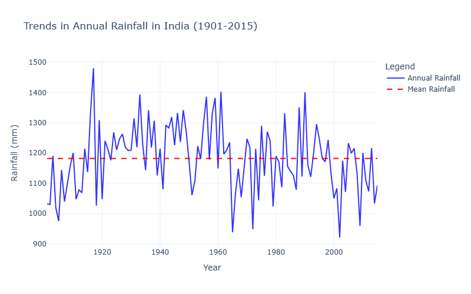
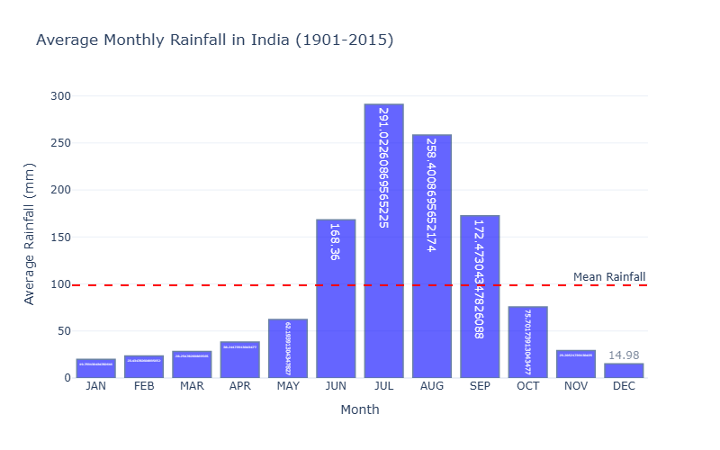
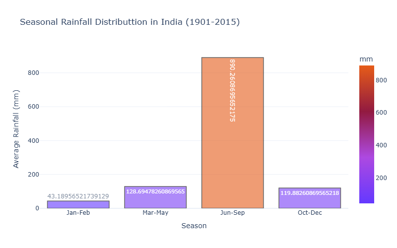
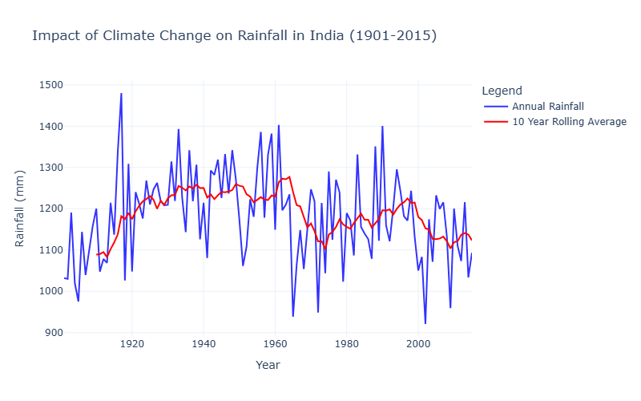
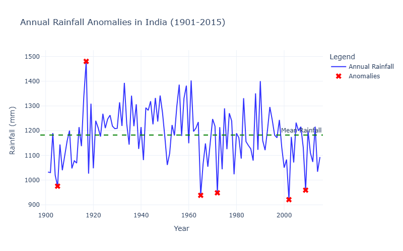
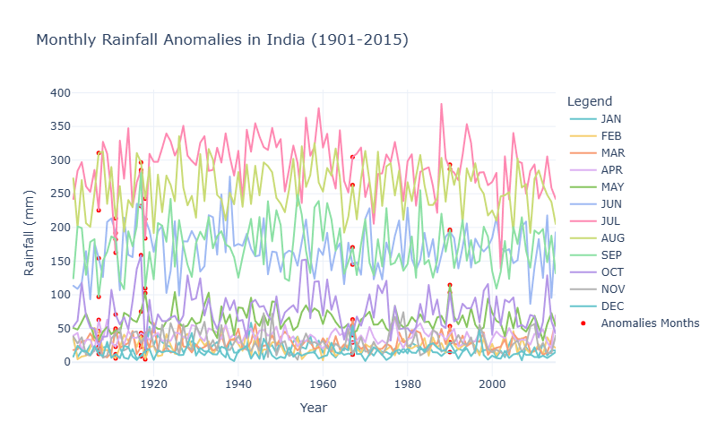
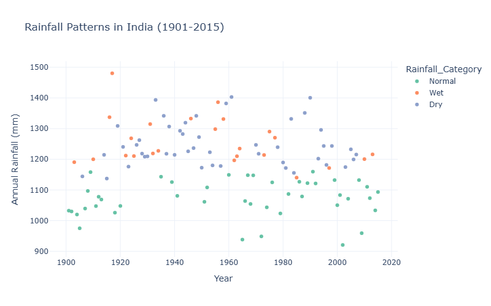
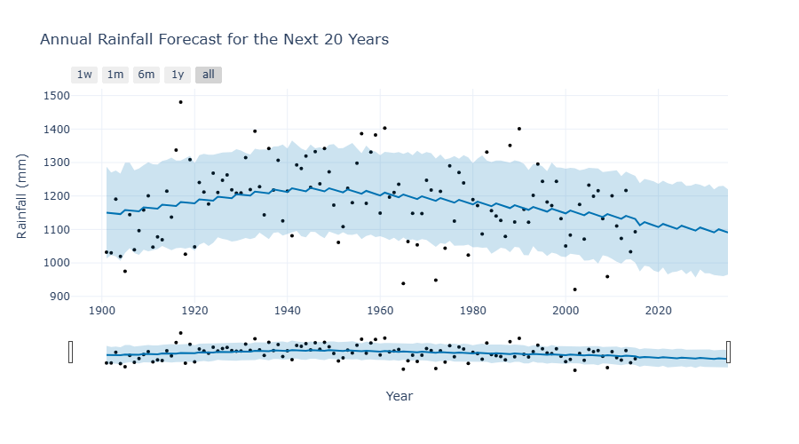

# **Rainfall Trends and Forecasting in India With Python**

## Project Overview
This project analyzes rainfall trends in India over 115 years (1901-2015) to assess the impact of climate change, detect anomalies, and forecast future rainfall patterns. Using Python, we applied statistical techniques, machine learning, and time-series forecasting to gain insights into rainfall variability.

## Datasets
The project uses historical rainfall data for India from 1901-2015. It is  available from sources like the Indian Meteorological Department (IMD) or global datasets
The columns are:
 - Year: Observation year.
 - State/Region: Geographic location.
 - Monthly Rainfall (mm): Precipitation for each month.
 - Annual Rainfall (mm): Total yearly rainfall.

## Key Features
- Data Cleaning & Preprocessing: Handles missing values and structuring data for analysis.
- Long-Term Trend Analysis: Uses rolling averages to identify patterns.
- Extreme Rainfall Detection: Identifies drought and excessive rainfall years.
- Correlation Analysis: Measures the relationship between seasonal and annual rainfall.
- Anomaly Detection: Uses Isolation Forest algorithm to find unusual rainfall patterns.
- K-Means Clustering: Classifies years into different rainfall categories (Dry, Normal, Wet).
- Forecasting: Prophet algorithm to predict rainfall for next 20 years
## Technologies Used
- Libraries: Pandas, NumPy, Matplotlib, Seaborn, Plotly, Scikit-learn, Prophet
- Machine Learning Models: Isolation Forest, K-Means Clustering
## Steps Involved
### 1.Data Importing and Preprocessing 
- Import the dataset(rainfall_dataset_1901-2015) and check for null values
- Change the 'YEAR' column to datatime format
```python 
import pandas as pd

#importing datasets
rainfall_data = pd.read_csv('rainfall_area-wt_India_1901-2015.csv')

#change the format of YEAR
rainfall_data['DATE'] = pd.to_datetime(rainfall_data['YEAR'], format='%Y')
```
### 2.Exploratory Data Analysis (EDA)
- Visualize annual rainfall trends over time.
- Compare rainfall against the long-term mean.
- Analyze monthly and seasonal rainfall variations.
```python
#Annual rainfall trends over the years 
fig_annual = go.Figure()
fig_annual.add_trace(go.Scatter(
    x=annual_rainfall['YEAR'],
    y=annual_rainfall['ANNUAL'],
    mode='lines',
    name='Annual Rainfall',
    line= dict(color='blue', width=2),
    opacity=0.8
    ))
```
### 3.Extreme Rainfall Detection    
Identify years with significantly high or low rainfall using statistical thresholds
```python
highest_rainfall_month = monthly_avg.idxmax()
lowest_rainfall_month = monthly_avg.idxmin()
```
### 4. Correlation Analysis
Measure relationships between seasonal and annual rainfall using correlation coefficients with 
```python
    corr = pearsonr(rainfall_data[season], rainfall_data[monsoon_column])
```
### 5.Anomaly Detection
Apply the Isolation Forest algorithm to detect unusual rainfall patterns in annual and monthly data.
```python 
#detect anomlous rainfall years based on annual data
isolation_forest = IsolationForest(contamination=0.05, random_state=42)
rainfall_data['Annual_Anomaly'] = isolation_forest.fit_predict(rainfall_data[['ANNUAL']])
```
### 6.K-Means Clustering
- K-Means Clustering to classify years into Dry, Normal, and Wet categories.
```python
kmeans = KMeans(n_clusters=3, random_state=42)
rainfall_data['Rainfall_Cluster'] = kmeans.fit_predict(scaled_features)
```
### 7.Rainfall Forecasting
Prophet algorithm to predict rainfall for the next 20 years.
```python
prophet_model = Prophet()
prophet_model.fit(prophet_data)
#create a future dataframe for the next 20 years
future = prophet_model.make_future_dataframe(periods=20, freq='YE')
forecast = prophet_model.predict(future)
```
## Screenshots 










## Result Interpretation & Insights
- Rainfall Trends: High year-to-year variability, with the monsoon (~890 mm) as the primary contributor.
- Climate Impact: A slight post-1960 decline, with extreme drought (2002, 2009) and wet years (1917, 1990).
- Variability & Correlation: Monsoon rainfall strongly influences annual totals (0.93 correlation), while other seasons have minimal impact.
- Clustering Patterns: Increasing dry years suggest shifting rainfall dynamics.
- Forecasting: Prophet predicts a slight decline, highlighting the need for adaptive water management.

## Contributing
Contributions are always welcome!


